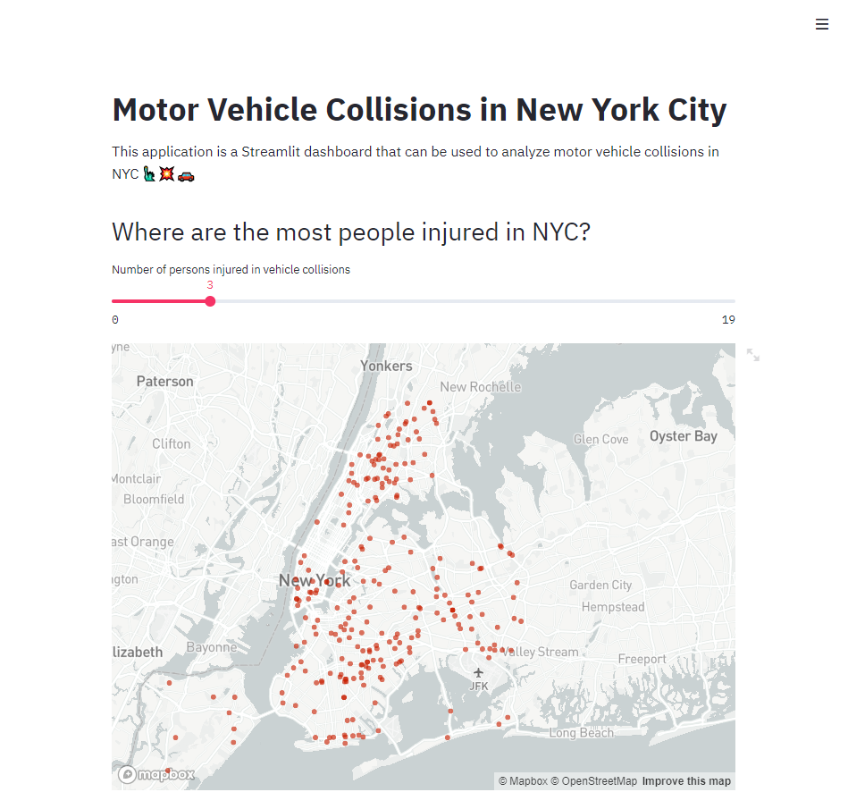
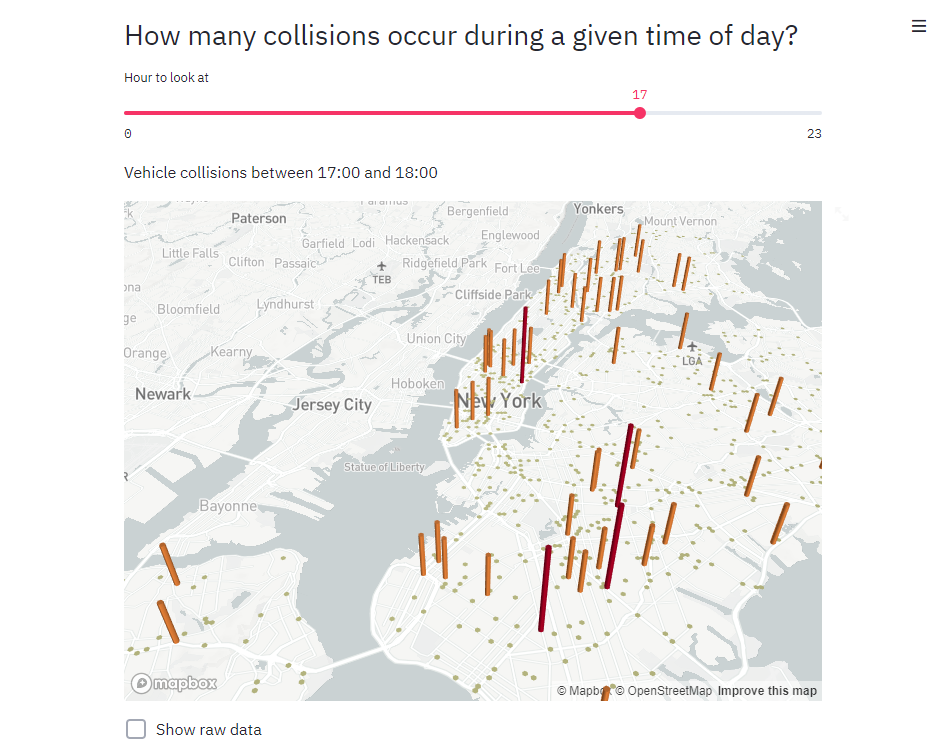
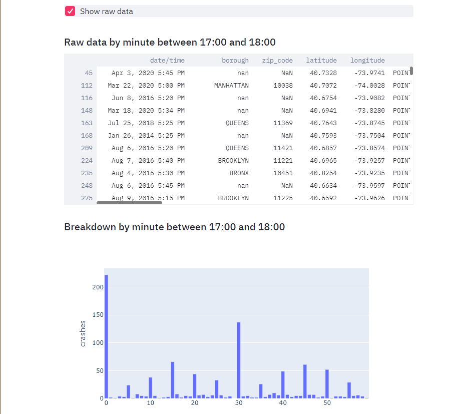
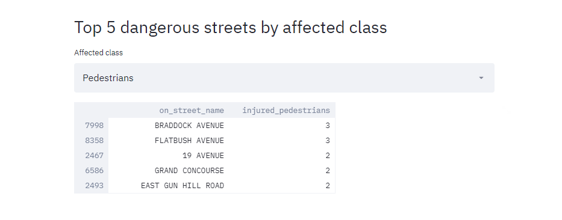

# Motor Vehicle Collisions in New York City

## Demo






## Prerequisites
* Dataset found at the following link: https://data.cityofnewyork.us/Public-Safety/Motor-Vehicle-Collisions-Crashes/h9gi-nx95
* Python
* Pip

To address the remaining framework requirements, enter the following command from the current app directory, in a terminal capable of running *pip* commands:


```bash

pip install -r requirements.txt --user

```

##### *Make sure to place the downloaded dataset in the app directory*

The main App directory should look something like this:
```
/local git clone folder
    - app.py
    - Motor_Vehicle_Collisions_-_Crashes.csv
    - requirements.txt
    - README.md

```

## How to run


After installing the necessary requirements, enter the app directory (or local git clone) and run the following command:

```bash
streamlit run app.py
```

It should be as easy as that.

